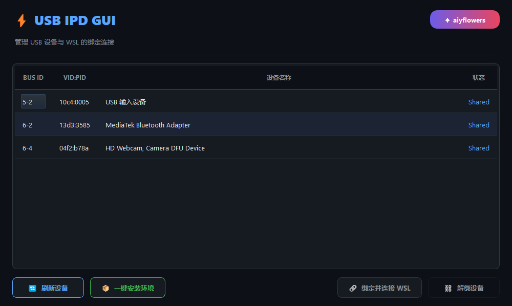

# Quick WSL USB

一个基于 PyQt5 的 GUI 工具，用于快速管理 USB 设备与 WSL 的绑定连接。

基于 [usbipd-win](https://github.com/dorssel/usbipd-win) 实现。

## 功能

- 扫描并列出当前 USB 设备
- 一键绑定 USB 设备到 WSL
- 一键解绑设备
- 一键安装 usbipd-win 环境

## 截图

## 使用方法

直接运行 `USB_IPD_GUI.exe` 即可。

## Author

aiyflowers
